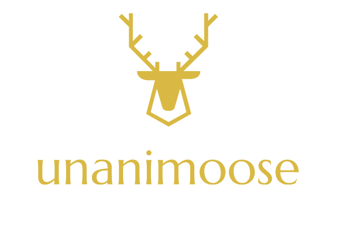

# Unanimoose!

<h1> What is this? </h1>

 Unanimoose is a social scheduling web app, that not only sets up your plans but creates and plans optimal times as well as events for social gatherings. This targets a big problem we face today, where many people are too lazy or forgetful to keep track of friends that they need to catch up with. This app takes in your availability and interests and integrates them with your friends for a perfect plan but in an easy way, with a clean look. It does all the grunt work for you, almost as if it was done Unanimosely!

<h1> How do you use it? </h1>

 This web app has a great backend (database), so you can easily register and have your very own account. With this you can create a group by inviting friends, don't worry about contacting them it'll take care of e-mailing them for you. All that it requires is what times are best for you and what events you're interested in. Don't worry about this either, all you'll have to do is select from tons of choices recommended by Unanimoose. It will find the best time for the group to meet up and set up the best plan as well! 

<h1> How does it work? </h1>

 We implemented html, css and javascript with a database in order to set up everything on this web app. The features made by this app include the selectable time table they give you, which is based on the current week or month. The plan suggestions, which is done by looking at popular hang out spots in the area (midpoint of you and all your friends). The voting which is a great way to see which of the top plans the group likes the best as well debate about.

<h1> Scalability and Potential </h1>

 This web app has tremendous potential that can be scaled effortlessly. This is a very thoughtful idea that can easily gain traction and change the way social gatherings happen, benefitting many. Machine learning can be implemented in order to track data of the meet ups in order to suggest better plans for the future as well as improve the app overall. This app can also take over many other categories if grown properly, for example reviewing places to hang out, could be something done by this app. In general this deals with a large problem that has affected almost everyone, so having a solution to this would save people a lot of time as well make plans more consistent.

 © Sai Oduri, Lors Kushtov, and Zain Kabani 

